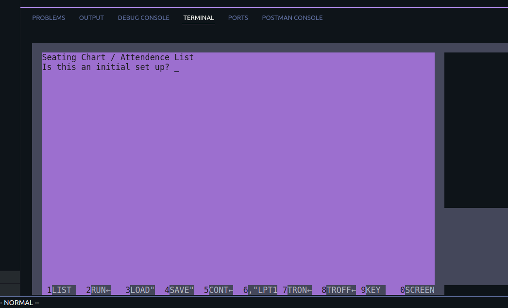
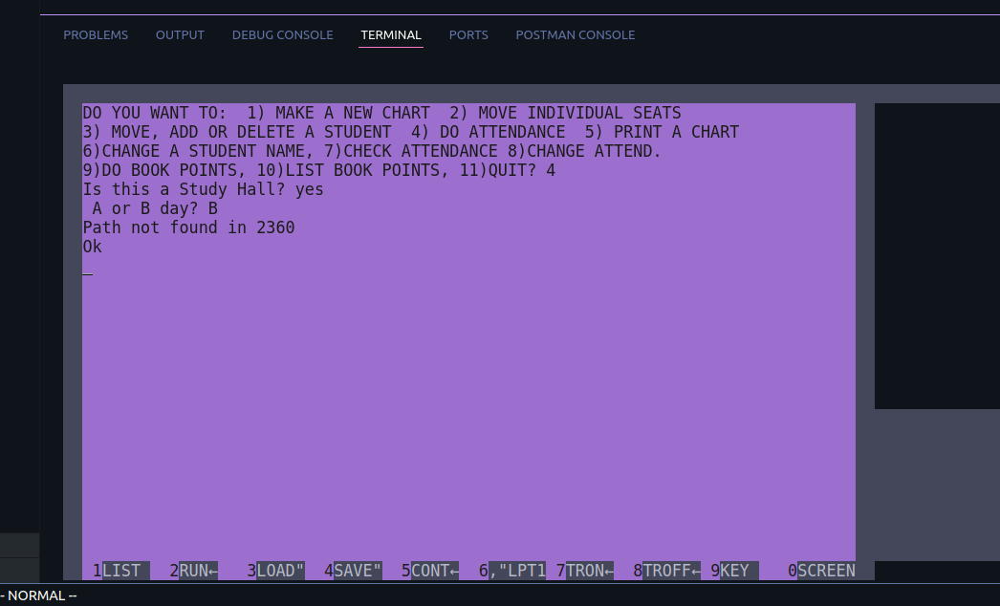
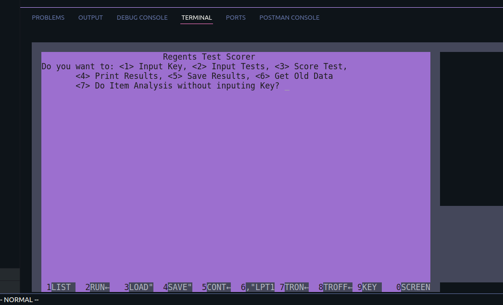
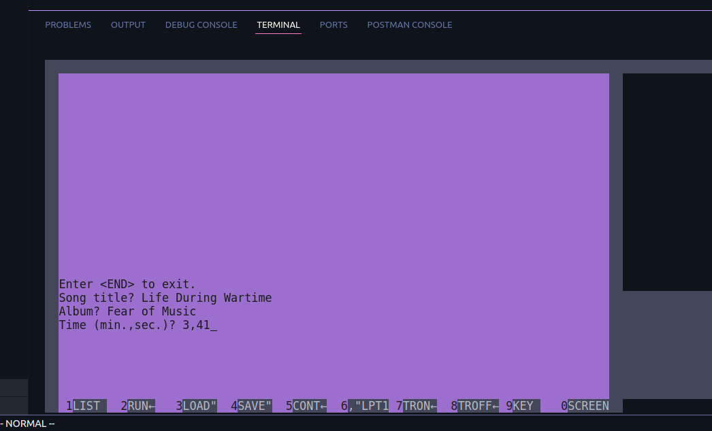

## Educator Tool Suite '87

This is a collection of `BASCIA` utility programs for classroom management written by my father, Mike Knox, in the late 1980s. These programs were designed to automate and streamline the clarical work that goes along with teaching 8th grade science - grading tests, assigning seats for classroom and lab, monitoring attendance, grading tests and state Regents exams, and more.

The program suite includes utilites for grading tests, generating random student seat assignments, handling attendance and grading on a curve. We have all kinds of tools to do these things today - even a simple spreadsheet will get you pretty far. But 40 years ago this was done, without exception, by hand. **Bonus**: there's a nifty routine for creating labels for your cassette tapes 📼

If you are a `BASIC` enthusiast or have an interest in period programming, or if you are an educator in the field, this repo is worth a fork and some messing around.
This is a great example of the best kind of software (at least in my opinion); code that automates away boring, monotonous stuff, so your focus can be on the work you _want_ to do. In this case, less paperwork and more teaching 🎓 📖 🧠 🧪!

_They came from an IBM formatted 3.5mm floppy disk, wich was the backup (labeled as such) - So the July 23, 1987 timestamp on `BASICA.EXE` was likely the backup date, not the modified timestamp for the working files._

<p float="left">




</p>

## Run in Docker
Since most of us do not have access to a working 8086 with DOS, the included emulation will come in handy. You can start the emulator with

```bash
    docker build . -t educator-87 && \
    docker run -it --rm educator-87
```

Once the emulator has started, pick a utility program you'd like to try (with the `.BAS` filetype) and follow [these directions](https://github.com/robhagemans/pcbasic?tab=readme-ov-file#basic-survival-kit). For example, if **I wanted to try out the Cassette Tape Maker (`TAPEMAKE.BAS`):**

```bash
#PC-BASIC 2.0.7
#(C) Copyright 2013-2023 Rob Hagemans.
#60300 Bytes free
#Ok
LOAD "TAPEMAKE"
#Ok
RUN
```

### Up Next
1. ~Encode the current `.bas` files from CP437 to UTF-8 so they can be easily read and modified~ ✔️
2. ~Get these utilities running in a container~ ✔️
3. Write some basic tests (pun intended) and have them running in Github CI for all the world to see
    - it would be great to publish the test outputs along the way (note: `TEST2` may be what we need?)
4. Write up docs and instructions for the different executables

**_Note_**: The fault errors you will run into periodically are because the emulator is looking for a floppy disk drive that does not exist (to save or retrieve state). To get these fully operational will most likely require tricking the emulator into mounting a local path as the F drive.